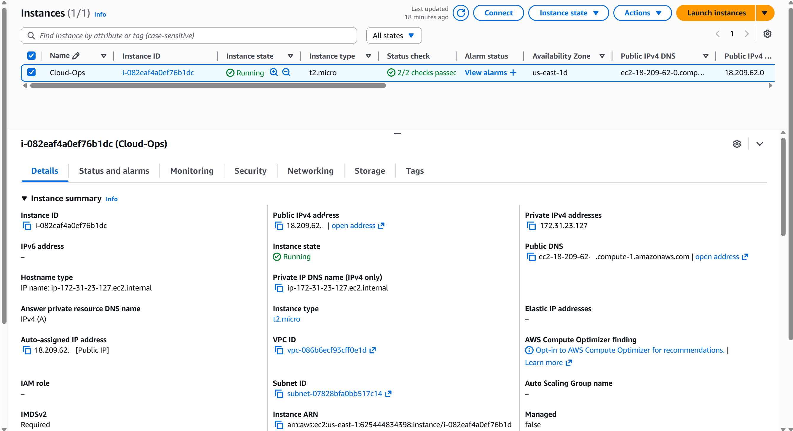
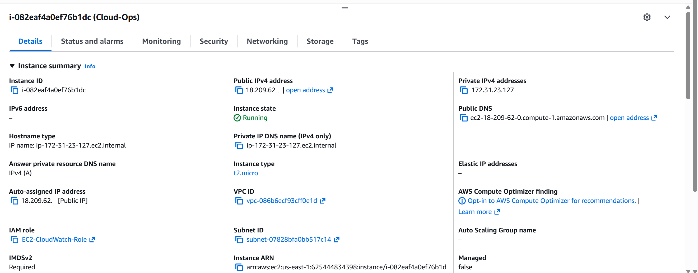
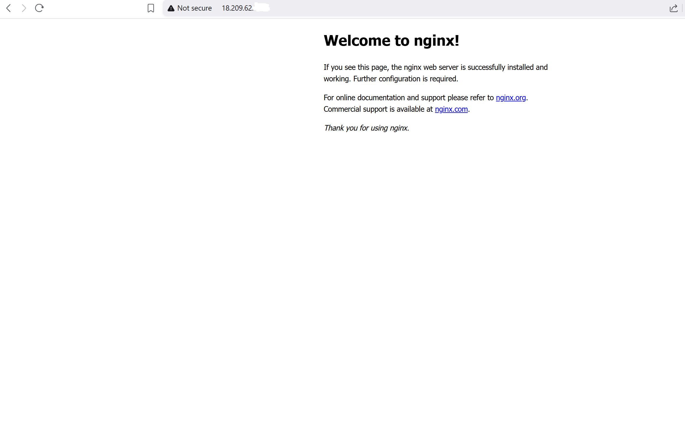
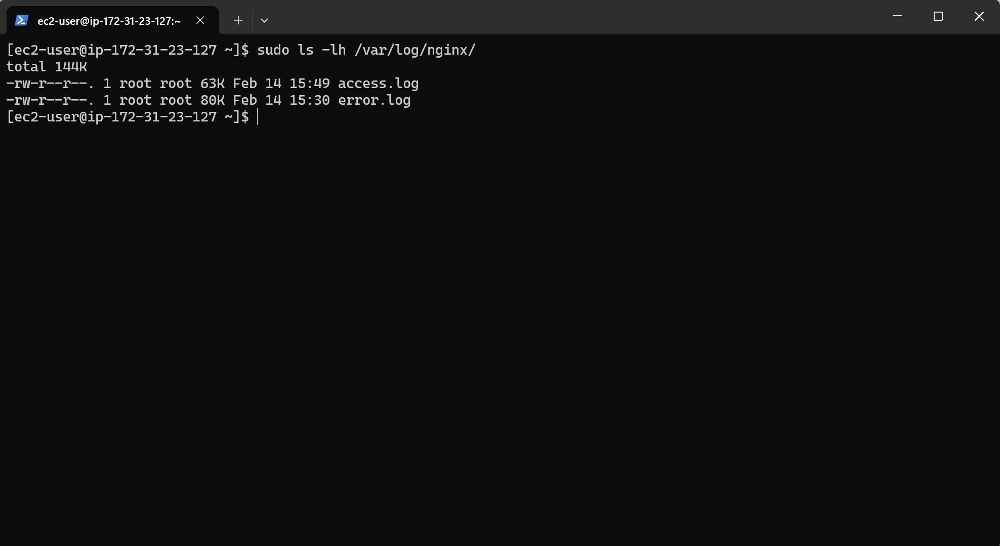
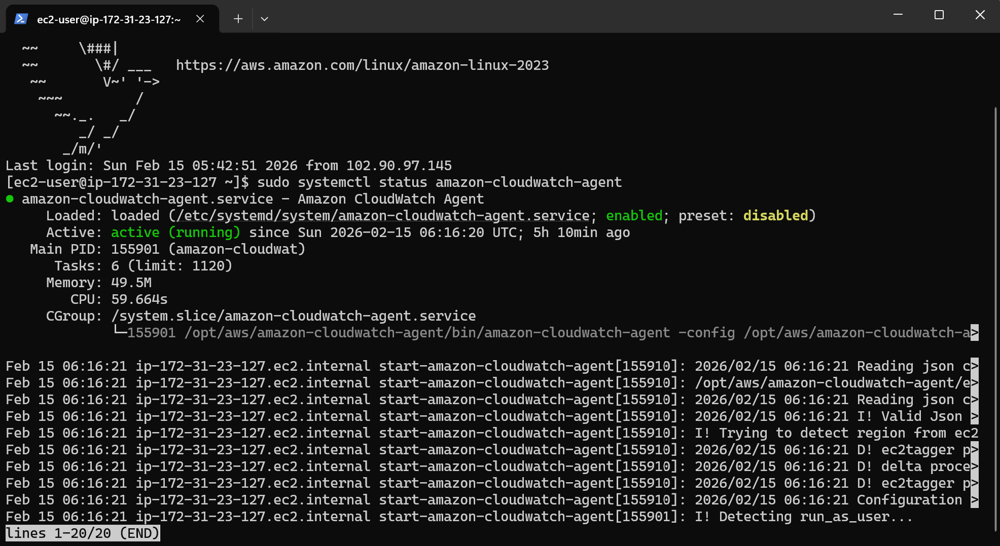
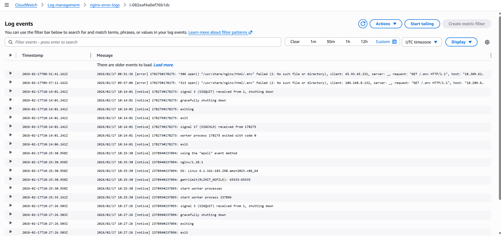
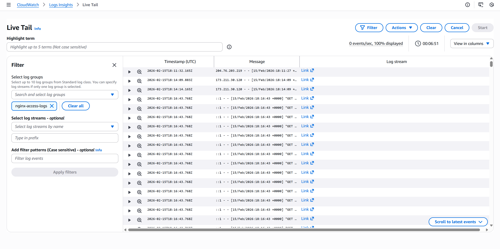
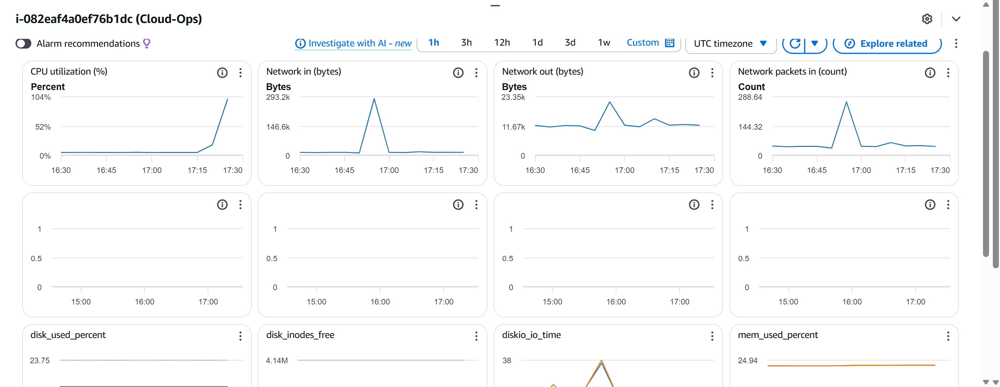
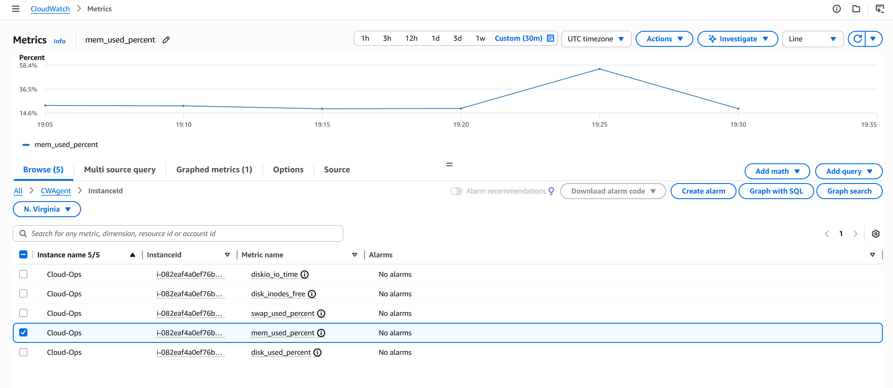

# 📊 EC2 Observability with Amazon CloudWatch (Logs & Metrics)

## 📌 Project Overview

Modern cloud systems fail silently if they are not observed properly.  
This project focuses on **building end-to-end observability into an EC2 instance**, not just running services.

I implemented **Amazon CloudWatch Metrics and Logs** on an Amazon Linux EC2 instance and deliberately **pushed the system into stress and failure scenarios** to observe:

- How incoming traffic is recorded through application access logs
- How application failures appear in error logs
- How CPU and memory pressure affect a live server
- How CloudWatch helps diagnose issues in real time
- Whether the system can recover without manual intervention

By combining **access logs, error logs, and system-level metrics**, this project demonstrates how observability provides both **request-level visibility** and **infrastructure-level insight** during normal operation and failure conditions.

Rather than stopping at “metrics enabled,” this project validates **what logs and metrics actually tell you** when something goes wrong.

---

## 🎯 Project Objectives

- Enable detailed system observability beyond default EC2 metrics
- Stream real application logs (Nginx access & error logs) to CloudWatch
- Simulate **CPU saturation and memory pressure**
- Observe system behavior during **service failure and recovery**
- Practice real-world troubleshooting using logs and metrics

---

## 🧰 Technologies Used

- **Amazon EC2** (Amazon Linux 2023)
- **Amazon CloudWatch**
- **Amazon CloudWatch Agent**
- **Nginx** (web server & log source)
- **stress** (CPU and memory load testing)
- **IAM** (EC2 Instance Role)

---

## 🏗 Architecture Overview

This project uses a single EC2-based architecture focused on host-level observability:

- An Amazon Linux EC2 instance runs Nginx as a sample application
- The CloudWatch Agent runs on the instance to collect:
  - OS-level metrics (CPU, memory)
  - Application logs (Nginx access and error logs)
- Logs and metrics are streamed to Amazon CloudWatch in near real time
- IAM roles are used for secure, credential-free access to CloudWatch APIs

This mirrors a common production pattern where application hosts are responsible for publishing their own telemetry.

---

## 🚀 Implementation Walkthrough (End-to-End)

### 1️⃣ EC2 & OS Preparation

- Launched an Amazon Linux 2023 EC2 instance
- Connected via SSH
- Updated system packages
- Confirmed OS tooling (`yum`, systemctl)

📸 **Screenshot:**  
  
*(EC2 instance running and reachable)*

---

### 2️⃣ IAM Role for Observability

- Created a dedicated EC2 IAM role
- Attached CloudWatch permissions
- Updated the running instance to use this role

This allowed the CloudWatch Agent to:
- Push logs
- Publish custom system metrics

📸 **Screenshot:**  

---

### 3️⃣ Nginx as a Real Log Source

Nginx was installed not just to serve traffic, but to **produce meaningful logs**.

- Installed and started Nginx
- Verified access logging
- Confirmed error log paths

📸 **Optional Screenshot:**  

---

### 4️⃣ CloudWatch Agent Configuration

- Installed Amazon CloudWatch Agent
- Used the interactive configuration wizard
- Enabled:
  - CPU utilization metrics
  - Memory utilization metrics
  - Nginx access logs
  - Nginx error logs
- Started and validated the agent service

📸 **Screenshot:**  

---

### 5️⃣ Log Streaming & Failure Simulation

To validate log observability:

- Confirmed Nginx access logs appeared in CloudWatch
- **Stopped the Nginx service intentionally**
- Observed error logs being generated and streamed in real time

This proved that CloudWatch was capturing **actual application failures**, not just normal traffic.

📸 **Screenshot:**  

---

6️⃣ Nginx Access Log Streaming (Traffic Visibility)

Beyond errors, understanding normal traffic patterns is essential for observability.

To validate request-level visibility:

Confirmed Nginx access logs were being written locally

Verified access logs were streamed to Amazon CloudWatch Logs

Observed incoming HTTP requests in near real time

Used access logs to correlate traffic activity with system metrics

This provides insight into:

Request frequency

Client access behavior

Traffic patterns during normal and stressed conditions

📸 Screenshot:

### 7️⃣ CPU Stress Testing (System Under Load)

- Installed `stress`
- Simulated high CPU usage on the instance
- Observed CPU utilization spike in CloudWatch metrics
- Verified the instance remained responsive

This validated:
- Metric accuracy
- System behavior under CPU pressure
High CPU utilization did not immediately destabilize the instance, demonstrating that CPU saturation alone does not always imply service failure.

📸 **Screenshot:**  

---

### 8️⃣ Memory Stress Testing & Recovery

- Used `stress` to simulate memory exhaustion
- Observed increased memory usage in CloudWatch
- The instance **recovered automatically** once stress was removed
This highlighted how memory pressure can degrade system performance even when CPU usage remains low, reinforcing the need for memory observability.

This demonstrated:
- System resilience
- Importance of memory metrics for capacity planning

📸 **Optional Screenshot:**  

---

## 🔍 Key Observations & Learnings

- Default EC2 metrics are not enough for real troubleshooting
- CloudWatch Agent provides **critical visibility** into memory usage
- Logs explain *why* something failed; metrics explain *how badly*
- Stress testing reveals system limits before production does
- Recovery behavior is just as important as failure detection

---

## 🧠 Skills Demonstrated
This project demonstrates hands-on cloud operations skills directly relevant to junior cloud, DevOps, and SRE roles:
- Linux system administration
- EC2 instance management
- IAM role design and troubleshooting
- CloudWatch Logs & Metrics
- Failure simulation and analysis
- Observability-first thinking

---

## 📷 Screenshot Philosophy

Screenshots were used **strategically**, not excessively, to:
- Prove log ingestion
- Show metric behavior under stress
- Validate IAM and agent configuration

Routine CLI output was intentionally excluded to keep the project **clear and professional**.

---

## 🚀 Future Enhancements

- Add CloudWatch alarms
- Build custom dashboards
- Query logs using CloudWatch Logs Insights
- Automate setup using Terraform
- Compare observability with and without CloudWatch Agent

---

## 👤 Author

**Chisom Eze**  
Cloud Operations & Engineering

**Focus:** Observability • CloudWatch • Failure Simulation • Linux Systems
